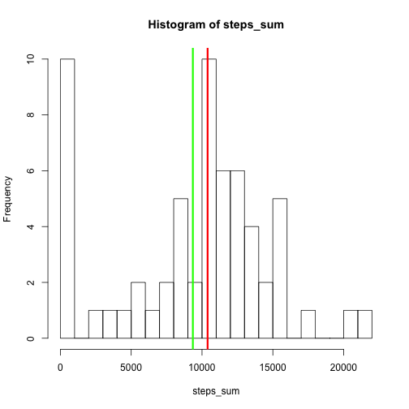
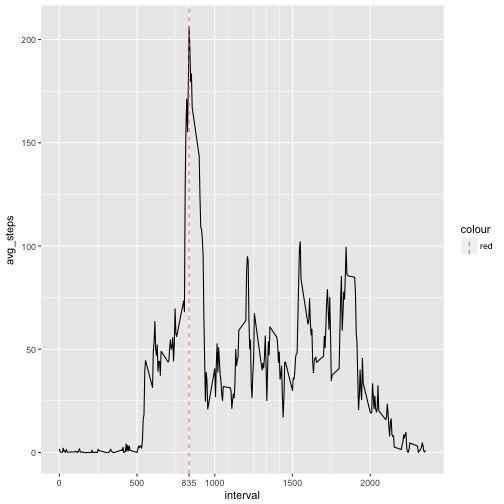
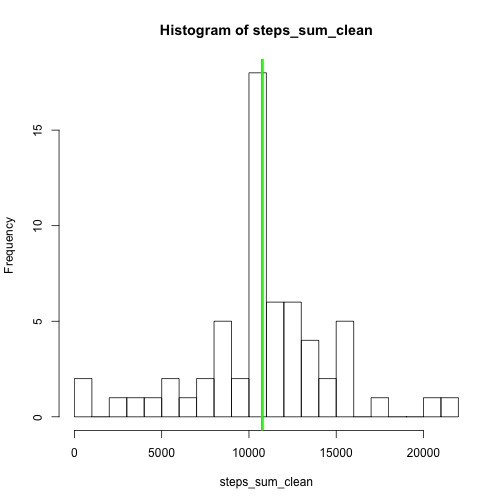
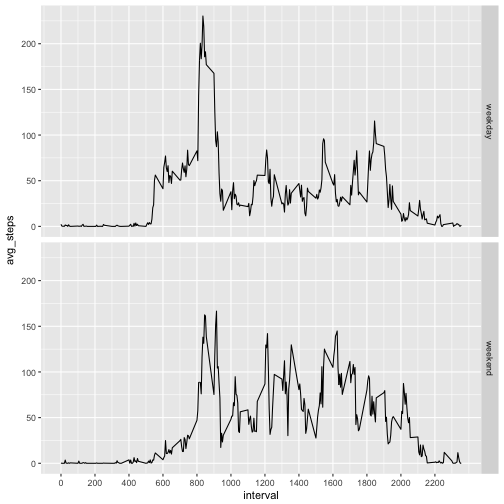

## Loading and preprocessing the data
**Load the data from CSV. Ensure that your current directory is set correctly.**

```r
data<-read.csv("activity.csv")
library(ggplot2)
```

## What is mean total number of steps taken per day?
**Histogram of total number of steps taken each day: **

```r
steps_sum<-tapply(data$steps,data$date,sum,na.rm=TRUE)
hist(steps_sum,breaks = 20)
abline(v=median(steps_sum),lwd=3,col="red")
abline(v=mean(steps_sum),lwd=3,col="green")
```



**Mean and Median of total steps per day: **

```r
print(mean(steps_sum))
```

```
## [1] 9354.23
```

```r
print(median(steps_sum))
```

```
## [1] 10395
```

## What is the average daily activity pattern?
**Time series plot of the 5-minute interval and the average number of steps taken, averaged across all days**

```r
steps_avg<-tapply(data$steps,data$interval,mean,na.rm=TRUE)
steps_avg_data<-data.frame(avg_steps=steps_avg,interval=names(steps_avg))
steps_avg_data$interval<-as.character(steps_avg_data$interval)
steps_avg_data$interval<-as.numeric(steps_avg_data$interval)
max<-steps_avg_data[steps_avg_data$avg_steps==max(steps_avg_data$avg_steps),2]
ggplot(steps_avg_data,aes(interval,avg_steps))+geom_line()+geom_vline(aes(xintercept=max,colour ="red"),linetype = "dashed")+scale_x_continuous(breaks=c(seq(0,2355,by = 500),max))
```



**5-minute interval which contains the maximum number of steps:**

```r
print(max)
```

```
## [1] 835
```

## Imputing missing values

**Missing Values in DataSet**


```r
sum(is.na(data$steps))
```

```
## [1] 2304
```
**Startegy for filling in all of the missing values in the dataset: Mean for that 5-minute interval**

```r
steps_avg_data_rounded<-steps_avg_data
steps_avg_data_rounded$avg_steps<-round(steps_avg_data_rounded$avg_steps)
data_clean<-apply(data,1,function(y){
  if(is.na(y[1]))
    y[1]<-(steps_avg_data_rounded[steps_avg_data_rounded$interval==as.numeric(y[3]),]$avg_steps)
    y
  })
data_clean_frame<-data.frame(steps=data_clean[1,],date=data_clean[2,],interval=data_clean[3,])
data_clean_frame$steps<-as.character(data_clean_frame$steps)
data_clean_frame$steps<-as.numeric(data_clean_frame$steps)
data_clean_frame$interval<-as.character(data_clean_frame$interval)
data_clean_frame$interval<-as.numeric(data_clean_frame$interval)
steps_sum_clean<-tapply(data_clean_frame$steps,data_clean_frame$date,sum,na.rm=TRUE)
hist(steps_sum_clean,breaks = 20)
abline(v=median(steps_sum_clean),lwd=3,col="red")
abline(v=mean(steps_sum_clean),lwd=3,col="green")
```



**Mean and Median of total steps per day: **

```r
print(mean(steps_sum_clean))
```

```
## [1] 10765.64
```

```r
print(median(steps_sum_clean))
```

```
## [1] 10762
```

**Do these values differ from the estimates from the first part of the assignment? What is the impact of imputing missing data on the estimates of the total daily number of steps?**

After imputing missing data with mean of that interval, the spread of data is very smooth.


```
## [1] "Mean with missing data:"
```

```
## [1] 9354.23
```

```
## [1] "Mean with clean data filled with mean of intervals:"
```

```
## [1] 10765.64
```

```
## [1] "Median with missing data:"
```

```
## [1] 10395
```

```
## [1] "Median clean data filled with mean of intervals:"
```

```
## [1] 10762
```

## Are there differences in activity patterns between weekdays and weekends?

```r
data_clean_frame$date<-as.Date(data_clean_frame$date)
weekdays <- c("Monday", "Tuesday", "Wednesday", "Thursday", "Friday")
data_clean_frame$wDay <- factor((weekdays(data_clean_frame$date) %in% weekdays),levels=c(FALSE, TRUE), labels=c('weekend', 'weekday'))
data_clean_frame_weekday<-subset(data_clean_frame,wDay=="weekday")
data_clean_frame_weekend<-subset(data_clean_frame,wDay=="weekend")
steps_avg_weekday<-tapply(data_clean_frame_weekday$steps,data_clean_frame_weekday$interval,mean,na.rm=TRUE)
steps_avg_weekend<-tapply(data_clean_frame_weekend$steps,data_clean_frame_weekend$interval,mean,na.rm=TRUE)
steps_avg_weekday_df<-data.frame(avg_steps=steps_avg_weekday,interval=names(steps_avg_weekday),wDay=rep("weekday",nrow(steps_avg_weekday)))
steps_avg_weekend_df<-data.frame(avg_steps=steps_avg_weekend,interval=names(steps_avg_weekend),wDay=rep("weekend",nrow(steps_avg_weekend)))
steps_avg_df<-rbind(steps_avg_weekday_df,steps_avg_weekend_df)
steps_avg_df$interval<-as.character(steps_avg_df$interval)
steps_avg_df$interval<-as.numeric(steps_avg_df$interval)
ggplot(steps_avg_df,aes(interval,avg_steps))+geom_line()+facet_grid(wDay~.)+scale_x_continuous(breaks=seq(0,2355,by = 200))
```


